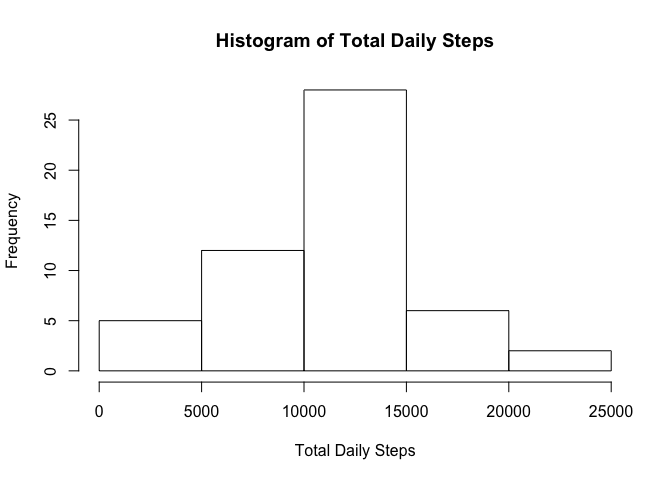
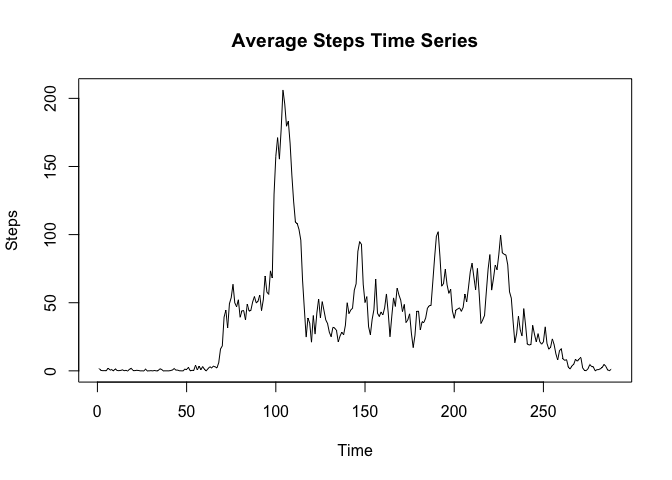
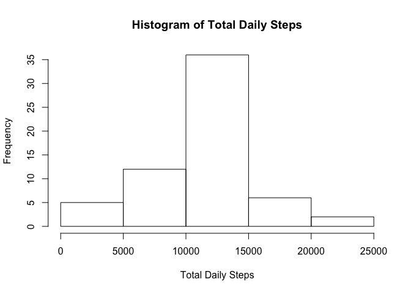
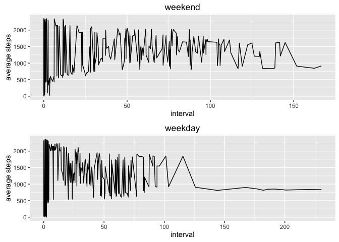

# steps
Guy Cole  
August 28, 2016  


### Task 1. Read data file

```r
fileName = "activity.csv"
rawData <- read.csv(fileName, header=TRUE)
```


### Task 3.  Discover daily mean, median and total steps (contained in RawDailyScore)

```r
rawDailyScore <- rawData %>% group_by(date) %>% summarise(totalSteps = sum(steps), meanSteps = mean(steps), medianSteps = median(steps))
```

### Task 2. Histogram for daily step population

```r
hist(rawDailyScore$totalSteps, main="Histogram of Total Daily Steps", xlab="Total Daily Steps")
```

<!-- -->

### Task 6. Pad missing data with interval average

```r
missingStep <- is.na(rawData$steps)
missingPopulation <- sum(missingStep)

rawIntervalMean <- rawData %>% group_by(interval) %>% summarise_each(funs(mean(., na.rm=TRUE)))

date <- as.Date(rawData$date)
interval <- rawData$interval
steps <- vector(mode="integer", length=length(rawData$steps))
dayFlag <- vector(mode="logical", length=length(date))

for (ii in 1:length(rawData$steps)) {
  if (is.na(rawData$steps[ii])) {
    temp <- filter(rawIntervalMean, interval == rawData$interval[ii])
    steps[ii] = temp$steps
  } else {
    steps[ii] = rawData$steps[ii]
  }
}

weekDayCounter = 0
weekEndCounter = 0

for (ii in 1:length(date)) {
  temp <- weekdays(date[ii])
  if (strcmp(temp, "Saturday") || strcmp(temp, "Sunday")) {
    dayFlag[ii] = TRUE
    weekEndCounter = weekEndCounter + 1
  } else {
    dayFlag[ii] = FALSE
    weekDayCounter = weekDayCounter + 1
  }
}

cookedData = data.frame(date, interval, steps, dayFlag)

cookedIntervalMean <- cookedData %>% group_by(interval) %>% summarise(meanSteps = mean(steps))
```

### Task 4. Time series plot of mean steps

```r
plot(cookedIntervalMean$meanSteps, type="l", main="Average Steps Time Series", xlab="Time", ylab="Steps")
```

<!-- -->

### Task 5. Five minute interval w/max steps

```r
maxStep <- max(cookedData$steps)
maxStepRow <- filter(cookedData, steps == maxStep)
print(sprintf("max steps %d on interval %d", maxStepRow$steps, maxStepRow$interval))
```

```
## [1] "max steps 806 on interval 615"
```

### Task 7. Histogram of total daily steps w/cooked data set

```r
cookedDailyScore <- cookedData %>% group_by(date) %>% summarise(totalSteps = sum(steps), meanSteps = mean(steps), medianSteps = median(steps))

hist(cookedDailyScore$totalSteps, main="Histogram of Total Daily Steps", xlab="Total Daily Steps")
```

<!-- -->

### Task 8. Panel plot w/average steps across weekday/weekend 

```r
weekEndData <- filter(cookedData, dayFlag == TRUE)
weekEndIntervalMean <- weekEndData %>% group_by(interval) %>% summarise(meanSteps = mean(steps))
p1 <- ggplot(weekEndIntervalMean, aes(x=meanSteps, y=interval)) + labs(title="weekend", x="interval", y="average steps") + geom_line()

weekDayData <- filter(cookedData, dayFlag == FALSE)
weekDayIntervalMean <- weekDayData %>% group_by(interval) %>% summarise(meanSteps = mean(steps))
p2 <- ggplot(weekDayIntervalMean, aes(x=meanSteps, y=interval)) + labs(title="weekday", x="interval", y="average steps") + geom_line()

p3 <- grid.arrange(p1, p2, nrow = 2, ncol = 1)
```

<!-- -->

## The End
